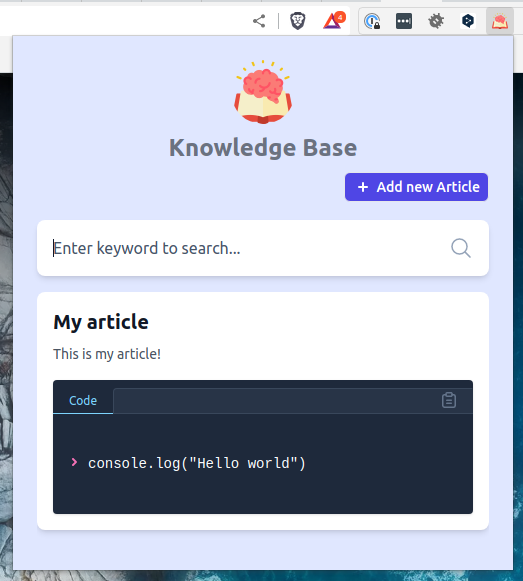

# Knowledge Base Chrome Extension
This is a self-study project for creating a chrome extension that allows you to search for articles in a knowledge base, using Supabase as the database and Tailwind CSS for styling. It also uses dotenv-webpack to manage environment variables.


### Features
- Search articles by keyword in title, description, or code
- View article details including title, description, and code (if applicable)
- Copy code snippet to clipboard with a single click
- Add new articles with a title, description, and optional code snippet


### Getting Started
Clone this repository and navigate to the project directory:

```bash
> git clone https://github.com/tdrcavallini/knowledge-base-chrome-extension.git
> cd knowledge-base-chrome-extension
```


### Install dependencies:
```bash
> npm install
```


Create a .env file in the root of the project and add your Supabase API key and URL:

:information_source: *For instructions on how to create a Supabase account and obtain these credentials, please see the Supabase documentation below.*


    SUPABASE_API_KEY=your_api_key
    SUPABASE_API_URL=https://your_project_url.supabase.co/


Build the extension for development:
```bash
> npm run build:dev
```

This command below runs the Tailwind CSS tool on the file "./src/style.css" and generates an output file "./dist/style.css" with the processed styles that are used to style the look and feel of the extension application.
```bash
> npx tailwindcss -i ./src/style.css -o ./dist/style.css
```

### Running Tests
Tests for this project are written using Jest. To run the tests, use the following command:
```bash
> npm test
```


### To install the extension in Chrome, follow these steps:
1. Open the Extension Management page by navigating to chrome://extensions.
2. Enable Developer Mode by clicking the toggle switch next to "Developer mode".
3. Click the "Load unpacked" button and select the dist directory in the project.
4. The extension should now be installed and you should be able to search for articles and view the results in the extension popup.

After following these steps, you will be able to view the installed extension in Chrome, as shown in the image below.




### Usage
- Click on the Knowledge Base icon in your browser
- Type a keyword in the search bar to search for articles
- Click on an article to view its details
- Click on the "Copy" button to copy code snippets to your clipboard


## Supabase
To create a database on Supabase, you will need to follow these steps:

- Sign up for a free Supabase account if you don't already have one.
- Go to the Supabase dashboard and click on "Add Project" to create a new project.
- Give your project a name and click "Create project".
- Once your project is created, click on "Add database" to create a new database.
- Choose a name for your database and click "Create database".
- Click on the "SQL" tab to access the SQL editor.
- Run the following SQL statement to create the articles table:

```sql
CREATE TABLE articles (
  id serial primary key,
  title varchar,
  description text,
  code text,
  created_at timestamptz default now()
);
```

This will create a table called articles with the specified columns. The id column is set as a serial primary key, which means it will automatically increment as new rows are inserted. The created_at column is set to the current timestamp by default.

| column_name | data_type                | character_maximum_length | column_default | is_nullable |
| ----------- | ------------------------ | ------------------------ | -------------- | ----------- |
| id          | int8                     |                          |                | NO          |
| title       | varchar                  |                          |                | YES         |
| description | text                     |                          |                | YES         |
| code        | text                     |                          |                | YES         |
| created_at  | timestamp with time zone |                          | now()          | YES         |

You can then insert rows into the table using the INSERT INTO statement. For example:
```sql
INSERT INTO articles (title, description, code) VALUES ('My article', 'This is my article', 'console.log("Hello world")');
```

This will insert a new row into the articles table with the specified values. You can also update and delete rows using the UPDATE and DELETE statements, respectively.


### Searchable columns
Let's create a new column fts inside the articles table to store the searchable index of the title, code and description columns.

We can use a special feature of Postgres called Generated Columns to ensure that the index is updated any time the values in the title and description columns change.

This SQL command below adds a new column to the articles table called "fts", which is a tsvector data type generated always as the concatenation of the title, description, and code columns, with English language text search configuration. The resulting tsvector is stored in the "fts" column.
```sql
alter table articles
add column
  fts tsvector generated always as (to_tsvector('english', coalesce(title, '') || ' ' || coalesce(description, '') || ' ' || coalesce(code, '') )) stored;
```

This SQL command below creates an index called "articles_fts" on the "articles" table using the "gin" index type. The "fts" column is used for full-text search in the index.
```sql
create index articles_fts on articles using gin (fts);
```
 
After adding the "fts" column to the articles table and create a index, you can check all the changes by using the following SQL command:
```sql
select column_name, data_type, character_maximum_length, column_default, is_nullable from INFORMATION_SCHEMA.COLUMNS where table_name = 'articles';
```
This SQL command retrieves information about the columns in the articles table from the INFORMATION_SCHEMA.COLUMNS system table. This can be useful for understanding the structure and properties of the articles table.

| column_name | data_type                | character_maximum_length | column_default | is_nullable |
| ----------- | ------------------------ | ------------------------ | -------------- | ----------- |
| id          | int8                     |                          |                | NO          |
| title       | varchar                  |                          |                | YES         |
| description | text                     |                          |                | YES         |
| code        | text                     |                          |                | YES         |
| created_at  | timestamp with time zone |                          | now()          | YES         |
| fts         | tsvector                 |                          |                | YES         |

For more information on working with databases in Supabase, you can refer to the [Supabase documentation](https://supabase.com/docs "Supabase documentation").


## Credits
- [Supabase](https://supabase.io "Supabase") for providing the realtime database
- [Tailwind CSS](https://tailwindcss.com/ "Tailwind CSS") for styling
- [Dotenv-webpack](https://www.npmjs.com/package/dotenv-webpack "Dotenv-webpack") for managing environment variables
- [Flaticon](https://www.flaticon.com/ "Flaticon") for icon


## License
This project is licensed under the MIT License - see the [LICENSE](LICENSE "LICENSE") file for details.
